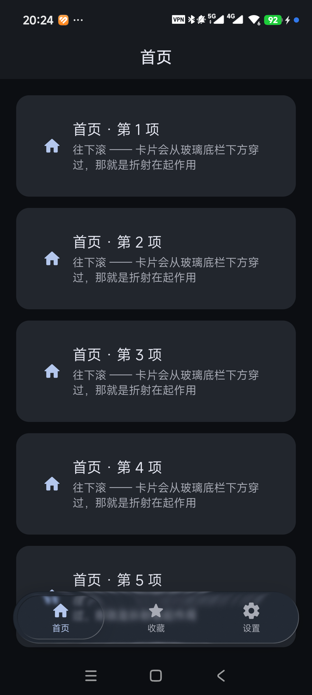

# Liquid Miuix

**MIUI / HyperOS 风格 + 真·液态玻璃（含折射）的 Jetpack Compose 前端方案。**

从参考实现 [KSuRoot](https://github.com/hmascs/KSuRoot) 的玻璃与主题实现中提炼，
抽成可复用模块，并补上了踩坑记录。



> 截图是 `example` 模块实际运行的效果。注意第 5 项卡片从底栏下方穿过时，
> 玻璃把它**折射并模糊**了 —— 这不是一张半透明 PNG 叠上去能达到的效果。

---

## 它解决什么问题

Compose 里做「液态玻璃」的常见做法有三种，都有各自的硬伤：

| 做法 | 问题 |
|---|---|
| 半透明白色 + 边框 | 静态贴图。**背景在它下面移动时完全不变**，一眼假 |
| `Modifier.blur()` | 只有模糊。**没有形变**，是「磨砂玻璃」不是「液态玻璃」 |
| 自定义 `RenderEffect` 链 | 方向对，但折射参数怎么调、为什么调完看不见，全靠试 |

本项目用的是**第三种**，并且把「怎么调」这件事写清楚了：

```
vibrancy()        →  blur(5dp)  →  lens(refractionHeight, refractionAmount, depthEffect)
饱和度 ×1.5          毛玻璃         折射（纯位移的 RuntimeShader）
```

关键结论（都有实测依据，见 [docs/02-glass.md](docs/02-glass.md)）：

- **折射位移至少要是模糊半径的 2 倍以上**，2.5 倍更稳。
  同量级时，把一张已经糊开的图平移几十像素，肉眼完全看不出差别；
- 玻璃需要**自己的半透明填充色** —— 折射是纯位移、模糊不改变平坦区平均色，
  这两件事对「背后是一片纯色」都无能为力；
- **背景必须比卡片暗一档**，否则「背后什么都没有」，模糊在数学上不可见；
- 布局约束：玻璃修饰符只能挂在**不含子内容**的 Box 上，内容做实它的**兄弟**。

---

## 快速开始

### 依赖

```kotlin
// 全部必须。版本号不要随意改，理由见下方「两个版本陷阱」
api("top.yukonga.miuix.kmp:miuix-ui-android:0.9.4")     // MIUI 组件库
api("top.yukonga.miuix.kmp:miuix-icons-android:0.9.4")
api("io.github.kyant0:backdrop-android:2.0.1")          // 液态玻璃（含 lens 折射）
api("com.materialkolor:material-kolor:4.1.1")           // 动态取色（Monet）
api("androidx.compose.material3:material3:1.5.0-alpha22")
api("androidx.compose.material:material-icons-extended:1.7.8")
```

```kotlin
// android { }
compileSdk = 37      // miuix 0.9.4 的 AAR 元数据要求
minSdk     = 33      // miuix-blur 硬编码
```

### 最小用法

```kotlin
setContent {
    LiquidTheme {          // miuix 主题 + Monet 动态取色 + Material3 语义色映射
        AppShell()
    }
}
```

`AppShell` 的结构**必须照抄** —— 具体原因见 [docs/02-glass.md](docs/02-glass.md)：

```kotlin
Box(Modifier.fillMaxSize()) {
    CompositionLocalProvider(LocalGlassBackdrop provides backdrop) {
        Scaffold(containerColor = Color.Transparent) { padding ->
            Box(Modifier.fillMaxSize()) {

                // ① 采集层：背景 + 全部页面内容
                Box(Modifier.fillMaxSize().layerBackdrop(backdrop)) {
                    AppBackground()
                    AnimatedContent(...) { page -> YourPage(page) }
                }

                // ② 玻璃浮层：必须在采集层**之外**
                Box(Modifier.fillMaxSize().padding(padding)) {
                    Box(Modifier.align(Alignment.BottomCenter)
                        .padding(start = 16.dp, end = 16.dp, bottom = 16.dp)
                        .fillMaxWidth().height(64.dp)
                        .graphicsLayer { scaleX = barScale; scaleY = barScale }
                    ) {
                        // 玻璃底板：不含任何子内容
                        Box(Modifier.matchParentSize()
                            .glassNavBar(backdrop = backdrop,
                                         shape = RoundedCornerShape(50)))
                        // 内容层：与玻璃是**兄弟**
                        GlassNavBarContent(items = ..., backdrop = backdrop)
                    }
                }
            }
        }
    }
}
```

---

## 模块内容

```
library/src/main/java/com/liquidmiuix/
├── glass/
│   ├── GlassSurface.kt        液态玻璃配方 + AppBackground + Modifier.liquidGlass
│   └── GlassNavBarContent.kt  悬浮玻璃底栏（含可拖动的高亮滑块）
├── theme/
│   └── LiquidTheme.kt         主题、Monet 取色、圆角/间距/排版/动效令牌
└── ui/
    └── Components.kt          Card / ListItem / Pill / 状态条 / 进度 / 空态 / 错峰入场

example/                       可运行示例（3 个页面 + 玻璃底栏）
```

### 玻璃底栏不只是「换个颜色」

`GlassNavBarContent` 是个会滑动的高亮玻璃胶囊：

- 点 tab → 弹簧飞过去
- **拖滑块 → 每帧手动积分二阶弹簧追手指**，拖尾与回弹就是果冻感
- 拖动中胶囊横向拉长（形变锚点是最近的 tab），用 `smoothstep` 而非线性
- 按下时**整条 dock 放大 1.04×，滑块再额外外扩 4dp**
  （布局期同步改尺寸+位移，保证四边等距，而不是线性缩放把胶囊拉成椭圆）

---

## 动态取色（Monet）

`LiquidTheme` 默认 **跟随壁纸**：换张壁纸，全应用主色跟着变。

```kotlin
LiquidTheme(accentColor = LiquidAccentColor.Dynamic)   // 默认
LiquidTheme(accentColor = LiquidAccentColor.MiuBlue)   // 原生 MIUI 蓝 #3482FF
```

`paletteStyle = Neutral` 让 surface / background 保持中性，
主色只作用于 primary 系（按钮、开关、选中态）。
这样「换主题色 = 换按钮颜色」，页面底色始终干净 —— **玻璃也才有稳定的采样底**。

---

## 两个版本陷阱

这两个坑都会让人以为是自己的代码写错了，实际是依赖解析问题。

### 1. `org.jetbrains.kotlin.android` 不要显式声明

AGP 9 起已内置 Kotlin 支持。再加这个插件会报：

```
The 'org.jetbrains.kotlin.android' plugin is no longer required for Kotlin support since AGP 9.0
```

### 2. material3 的版本会被 miuix 改写

```
androidx.compose.material3:material3:1.3.1 -> 1.5.0-alpha22
```

miuix 0.9.4 自己会把 material3 提到 **alpha22**。你声明别的版本
（比如稳定版 1.4.0）会被 Gradle 按「最高版本优先」改写 ——
**最终运行的版本既不是你声明的那个，也可能与 miuix 编译时的 API 对不上。**

声明必须落在这条链上。用这个命令核对：

```bash
./gradlew :library:dependencies --configuration debugRuntimeClasspath | grep material3
```

---

## 已知问题

**启动闪退：渲染树栈溢出。**
症状是「点开黑屏约 1 秒后闪退」，崩溃栈：`Fatal signal 11 (SIGSEGV) in RenderThread` /
`Cause: stack pointer is not in a rw map; likely due to stack overflow.` /
`512 total frames` 全在 `libhwui RenderNode::prepareTreeImpl`。

**九成是把玻璃放在了采集层里面。** 完整解释与排查步骤见
[docs/04-troubleshooting.md](docs/04-troubleshooting.md)。

---

## 文档

| 文档 | 内容 |
|---|---|
| [docs/01-getting-started.md](docs/01-getting-started.md) | 环境要求、依赖、目录结构、如何跑起来 |
| [docs/02-glass.md](docs/02-glass.md) | 液态玻璃配方、参数怎么调、布局硬约束 |
| [docs/03-design-tokens.md](docs/03-design-tokens.md) | 圆角、间距、排版、动效令牌与取值依据 |
| [docs/04-troubleshooting.md](docs/04-troubleshooting.md) | 闪退、玻璃看不见、文字发灰等问题的排查 |

---

## 环境

| 项 | 版本 |
|---|---|
| AGP | 9.2.1 |
| Gradle | 9.4.1+ |
| Kotlin | 2.4.20 |
| compileSdk | 37 |
| minSdk | 33 |
| 验证机型 | 小米 25019PNF3C / Android 17 / HyperOS |

---

## 许可

Apache-2.0。玻璃配方与主题实现源自 [KSuRoot](https://github.com/hmascs/KSuRoot)（Apache-2.0），
参数取值与踩坑结论来自其源码注释，一并保留致谢。
